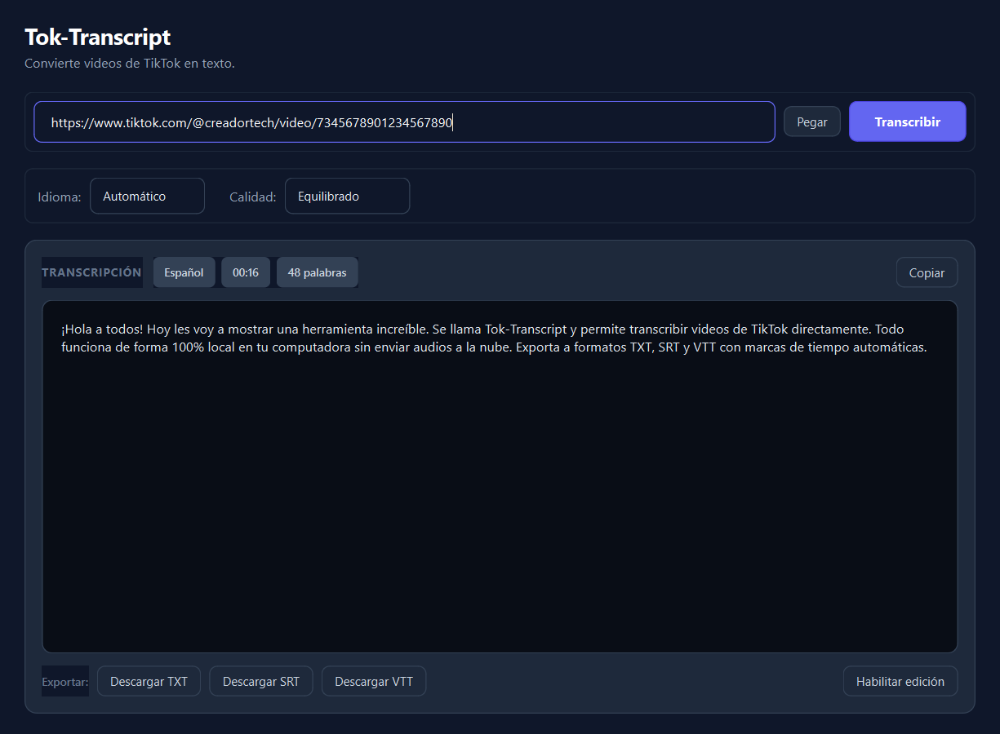

# Tok-Transcript 🎙️⚡

**Tok-Transcript** es una aplicación de escritorio nativa para Windows construida con **Python 3.11+**, **PySide6**, **yt-dlp**, **FFmpeg** y **faster-whisper**.

Permite recibir una URL pública de un video de TikTok, extraer únicamente el flujo de audio necesario en segundo plano, normalizarlo, transcribirlo localmente mediante inteligencia artificial (sin enviar datos a servidores externos) y exportar el resultado con precisión milimétrica en formatos **TXT**, **SRT** y **WebVTT**.

La interfaz gráfica sigue una estética moderna y minimalista inspirada en herramientas SaaS de alta productividad (Linear, Raycast, Notion), con un tema oscuro refinado, retroalimentación en tiempo real y ejecución asíncrona que garantiza cero congelamientos de la interfaz.

---

## 📸 Capturas de la Aplicación



---

## 🏗️ Arquitectura del Sistema

El proyecto está diseñado bajo principios de separación estricta de responsabilidades (SoC) y código limpio:

```
Tok-Transcript/
│
├── main.py                     # Punto de entrada de la aplicación y carga de estilos
│
├── app/                        # Capa de Interfaz Gráfica (PySide6)
│   ├── __init__.py
│   ├── main_window.py          # Ventana principal, layout responsivo y gestión de hilos
│   ├── widgets/
│   │   ├── url_input.py        # Campo de entrada con botón Pegar y Transcribir
│   │   ├── settings_panel.py   # Selectores de idioma y preset de calidad/modelo
│   │   ├── progress_panel.py   # Barra de progreso y estado dinámico en vivo
│   │   └── transcript_view.py  # Editor de texto, métricas y acciones de exportación
│   └── dialogs/
│       └── error_dialog.py     # Diálogos modales con mensajes claros y diagnóstico opcional
│
├── core/                       # Servicios de Negocio (Puros, sin dependencia de Qt)
│   ├── downloader.py           # Descarga de audio optimizado con yt-dlp
│   ├── audio_processor.py      # Normalización a WAV PCM 16kHz mono con FFmpeg
│   ├── transcriber.py          # Transcripción local con faster-whisper y caché de modelos
│   ├── exporter.py             # Exportadores a TXT, SRT y VTT con cálculo de marcas de tiempo
│   └── exceptions.py           # Jerarquía de excepciones amigables para el usuario
│
├── workers/                    # Concurrencia Asíncrona
│   └── transcription_worker.py # QThread desacoplado con señales tipadas
│
├── models/                     # Contratos y Estructuras de Datos
│   └── transcript.py           # TranscriptResult y TranscriptSegment (@dataclass)
│
├── utils/                      # Utilidades y Soporte
│   ├── paths.py                # Resolución de rutas para desarrollo y PyInstaller (_MEIPASS)
│   ├── validators.py           # Validación y sanitización de URLs de TikTok
│   ├── config.py               # Presets de calidad, idioma y constantes del sistema
│   └── logger.py               # Registro rotativo en logs/app.log y consola
│
├── assets/                     # Recursos visuales
│   ├── icons/                  # Iconos de la aplicación (PNG, ICO)
│   └── styles/
│       └── app.qss             # Hoja de estilos moderna inspirada en Linear/Raycast
│
├── tests/                      # Suite de pruebas automatizadas (pytest)
├── temp/                       # Directorio para archivos intermedios (limpieza automática)
├── logs/                       # Registros de ejecución
├── pyinstaller.spec            # Configuración para empaquetado como ejecutable portable
├── requirements.txt            # Dependencias del proyecto
└── README.md                   # Documentación técnica completa
```

---

## ⚡ Flujo de Procesamiento Asíncrono

1. **Entrada y Validación**: El usuario pega una URL (o presiona "Pegar"). `utils/validators.py` verifica la estructura del enlace.
2. **Despacho al Worker**: Se deshabilita el botón "Transcribir" (cambiando su texto a "Procesando...") y se inicia un `TranscriptionWorker(QThread)`. La GUI permanece 100% interactiva.
3. **Descarga**: `core/downloader.py` invoca la API interna de `yt-dlp` configurada con `format: bestaudio/best`, transmitiendo el progreso de descarga a la barra visual.
4. **Normalización de Audio**: `core/audio_processor.py` utiliza FFmpeg para convertir el archivo descargado a WAV PCM 16-bit 16kHz mono, optimizando el rendimiento de Whisper.
5. **Transcripción Local**: `core/transcriber.py` ejecuta `faster-whisper`. Si el modelo ya se cargó previamente en la sesión, se reutiliza desde la memoria RAM (caché en memoria). Si es la primera vez que se utiliza, notifica al usuario: *"Preparando el motor de transcripción por primera vez..."*.
6. **Emisión de Resultados**: Se emite la señal `transcription_completed` con un objeto `TranscriptResult`. La interfaz muestra las insignias de metadatos (idioma detectado, duración formateada y conteo de palabras).
7. **Limpieza Rigurosa**: La cláusula `finally` del worker asegura que todos los archivos descargados y temporales sean eliminados de `temp/`, independientemente de si la operación tuvo éxito o falló.

---

## 📋 Requisitos del Sistema

- **Sistema Operativo**: Windows 10 / Windows 11 (64-bit)
- **Python**: 3.11 o superior (probado y verificado en Python 3.13)
- **Procesador**: CPU moderna (no se requiere tarjeta gráfica Nvidia/CUDA dedicada; la aplicación ejecuta Whisper en modo `cpu` con cuantización `int8`).
- **Memoria RAM**: 4 GB mínimo (8 GB recomendado para modelos `small` y `medium`).

---

## 🚀 Instalación y Ejecución

### 1. Clonar o acceder al proyecto
```powershell
cd c:\Users\Ingca\OneDrive\Escritorio\Tok-Transcript
```

### 2. Instalar dependencias
```powershell
python -m pip install -r requirements.txt
```

### 3. Ejecutar la aplicación
```powershell
python main.py
```

---

## 🔊 Configuración de FFmpeg

La aplicación incluye un sistema de resolución inteligente en `utils/paths.resolve_ffmpeg_path()`:

1. **Fallback automático integrado**: El paquete `imageio-ffmpeg` incluye un binario de FFmpeg probado para Windows que Tok-Transcript detecta y utiliza de forma transparente.
2. **PATH del sistema**: Si tienes FFmpeg instalado globalmente (`winget install Gyan.FFmpeg` o `choco install ffmpeg`), la aplicación lo detectará de inmediato.
3. **Carpeta local / Distribución**: Puedes colocar directamente `ffmpeg.exe` dentro de `assets/bin/ffmpeg.exe`, y la aplicación le dará prioridad máxima (ideal para distribución portable).

---

## 🧪 Pruebas Automatizadas

El proyecto cuenta con una batería completa de pruebas unitarias y de integración que verifican validadores, exportadores de subtítulos, formateo de timestamps y conversión real con FFmpeg:

```powershell
python -m pytest tests/ -v
```

---

## 📦 Empaquetado con PyInstaller (.exe portable)

El proyecto incluye el archivo `pyinstaller.spec` configurado para empaquetar la aplicación con todos sus assets, estilos y módulos requeridos:

```powershell
pyinstaller pyinstaller.spec --clean
```

El ejecutable generado se ubicará en la carpeta `dist/TokTranscript/TokTranscript.exe`.

### Características de portabilidad:
- Todas las rutas relativas se resuelven dinámicamente mediante `utils/paths.py` tanto en modo script (`python main.py`) como empaquetado (`sys._MEIPASS`).
- Los logs y archivos temporales de la versión compilada se gestionan en `%LOCALAPPDATA%\TokTranscript` para evitar problemas de permisos de escritura en carpetas protegidas como `Program Files`.

---

## 💿 Instalador de Windows (Setup.exe)

El proyecto incluye el script oficial para **Inno Setup** ([installer.iss](file:///c:/Users/Ingca/OneDrive/Escritorio/Tok-Transcript/installer.iss)) para compilar un instalador nativo de Windows con asistente guiado, accesos directos e instalador/desinstalador formal:

```powershell
# Compilar instalador con Inno Setup
& "$env:LOCALAPPDATA\Programs\Inno Setup 6\ISCC.exe" installer.iss
```

El instalador resultante se ubica en: `dist-installer/TokTranscript-Setup-v1.0.0.exe`.

También puedes compilar ambos en un solo paso ejecutando `build_all.bat`.

---

## 👤 Créditos

Desarrollado por **David Caro** [@ing.davidcaro](https://github.com/davidcaroo)  
*Ingeniero Informático - Construyendo aplicaciones web modernas, accesibles y escalables 🚀*

